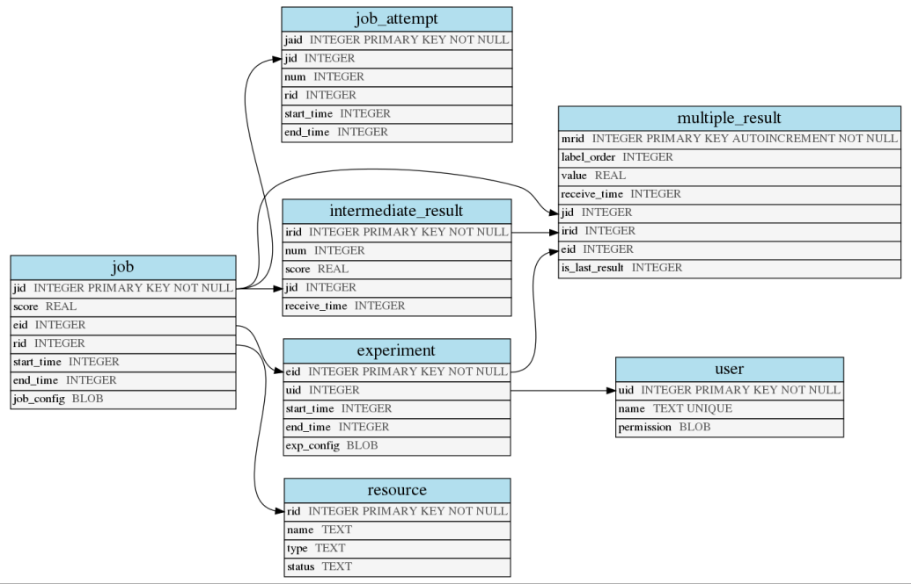

Setup environment
=================

**Auptimizer** needs to be initialized properly before use, either through `python -m aup.setup` for interactive setup or `python -m aup.setup <config.ini>` with the specified configuration file. \
**We recommend users to use the interactive setup for the first time**.

The configuration file is to set up **all** environment-related information for **Auptimizer**, such as number of CPUs, GPUs, or remote servers.
All your experiments and jobs will use the configuration.

Configuration Options
---------------------

Two templates can be found at :code:`Examples/2dfunc_diff_res/*.ini`.
The detailed options are as follows.

Environment Template File (\*.ini)
~~~~~~~~~~~~~~~~~~~~~~~~~~~~~~~~~~

For a normal workstation, an example template is at :code:`Examples/2dfunc_diff_res/env_user_template.ini` for direct use. The command below will create a user environment profile (at `~/.aup/env.ini`) for quick-start::

  python -m aup.setup ./Examples/2dfunc_diff_res/env_user_template.ini

or to create a local environment folder for a particular experiment (in working folder `./.aup/env.ini`), use::

  python -m aup.setup ./Examples/2dfunc_diff_res/env_local_template.ini

The content of the template is the following:

+------------------+-----------------------------+--------------------------------------+
| Name             | Purpose                     | Default value                        |
+==================+=============================+======================================+
| Auptimizer_PATH  | configuration folder for    | ``.aup``                             |
|                  | Auptimizer, containing this |                                      |
|                  | ``env.ini`` file and        |                                      |
|                  | database file               |                                      |
+------------------+-----------------------------+--------------------------------------+
| SQL_ENGINE       | database engine, currently  | ``sqlite``                           |
|                  | only supports sqlite        |                                      |
+------------------+-----------------------------+--------------------------------------+
| TMP_FOLDER       | temp folder for logging /   | ``/tmp/aup`` or ``./aup_tmp``        |
|                  | scratch                     |                                      |
+------------------+-----------------------------+--------------------------------------+

Available resources for model training are specified by additional arguments, or via interactive questions.

========= ======== =====================================================================================================
Argument  Default  Details
========= ======== =====================================================================================================
--aws     none     a file containing ``user@instance-id``, or a comma-separated list
--cpu     4        Number of processors to use on a single machine.
--gpu     none     a file containing the GPU id number on a machine, or a comma-separated list.
--node    none     a file containing ``user@IP`` for training, or a comma-separated list
========= ======== =====================================================================================================

AWS Mapping Configuration (--aws)
~~~~~~~~~~~~~~~~~~~~~~~~~~~~~~~~~

**Auptimizer** has the capability to start and stop AWS instances and assign jobs dynamically to the instances depending
on availability. To allow fragmented resource utilization within the AWS instance, edit the resources available to
**Auptimizer** when installing it on the remote instance.

1. To use the Auptimizer’s AWS option, install and configure `boto3 <https://pypi.org/project/boto3/>`_ and ensure your AWS
instances can be accessed with boto3. Then proceed to `install configure AWS
CLI <https://docs.aws.amazon.com/cli/latest/userguide/cli-chap-install.html>`_.

2. To run jobs on multiple AWS instances, we need to specify an AWS mapping file with `--aws <aws_mapping_file>`. 
Similar to the above-mentioned node case, `<aws_mapping_file>` is a text file containing the username, AWS instance id
and the SSH key file (.pem file).

The format of the file must be one of the following:

  + `<username>@<instance_id> <ssh_key_file>`
  + `<username>@<instance_id>`
  + `<username>@<instance_id>:port`
  + `<username>@<instance_id>:port <ssh_key_file>`

with each instance on a separate line, or if you setup the configuration interactively, you can provide them as
comma-separated values. The ``username`` is the one used to log in the instance.  The ``instance_id`` can be the EC2
instance ID, IP, or public DNS.

Refer to ``Examples/2dfunc_diff_res/aws.txt`` as example..

3. Either you need to install **Auptimizer** on every node, or you need to copy ``<repo>/src/aup.py`` to your remote working
directory.

4. Also the environment of the instances might be *sourced* correspondingly for environment variables, e.g. ``PATH``.  For
instance, if you want to activate virtualenv on the instance before job running, use `prescript` in experiment.json (See
:ref:`AWSRuntimeAnchor` for more detail).

CPU Configuration (``--cpu``)
~~~~~~~~~~~~~~~~~~~~~~~~~~~~~

We can specify how many parallel jobs to be run on CPUs.
The current implementation does **NOT** provide real isolation of hardware.

GPU Mapping Configuration (``--gpu``)
~~~~~~~~~~~~~~~~~~~~~~~~~~~~~~~~~~~~~

To run jobs on multiple GPUs, we need to specify a GPU mapping file with ``--gpu <gpu_mapping_file>``.
This file is a text file containing the IDs of GPU cards to use (for ``CUDA_VISIBLE_DEVICES``).
Specifically, each line contains a GPU id as an integer.

+ For single GPU without parallel execution, use ``Examples/2dfunc_diff_res/plainGPU.txt``.
+ Assign multiple jobs to run on the same device by assigning multiple
  resource IDs to the same GPU id, i.e. ``0,0``). See ``Examples/2dfunc_diff_res/singleGPU.txt``.
+ Assign multiple jobs on different GPUs on a local machine, i.e.::
    
    0
    1

  See ``Examples/2dfunc_diff_res/twoGPUs.txt``.

Node Mapping Configuration (``--node``)
~~~~~~~~~~~~~~~~~~~~~~~~~~~~~~~~~~~~~~~

Similar to GPU mapping, users can specify the computing nodes to be used with ``--node <node mapping file>`` during setup

A node configuration file contains each node per line (e.g., ``username@hostname``.)
And an SSH connection without password authentication is required
(use ``ssh-keygen`` to create keyless access).

The format of the file must be one of the followings:

+ `<username>@<IP> <ssh_key_file>`
+ `<username>@<IP>`
+ `<username>@<IP>:port`
+ `<username>@<IP>:port <ssh_key_file>`

with each instance on a separate line, or if you setup the configuration interactively, you can provide them as
comma-separated values.

For remote execution, **Auptimizer** will not copy all job-related files to the remote machine.  User should make sure
the job script can run on the remote machine first.

Refer to ``Examples/2dfunc_diff_res/node.txt`` for an example.

Either you need to install **Auptimizer** on every node, or you need to copy ``<repo>/src/aup.py`` to your remote working
directory.

Optional arguments
~~~~~~~~~~~~~~~~~~

+ ``--overwrite`` - overwrite existing ``.aup`` folder. Otherwise, do nothing
+ ``--log`` - choose log level from ``[debug,info,warn,error]``
+ ``--user`` - not used. It specifies the user ownership for experiments.

Examples
~~~~~~~~

We provide examples of using different resources for **Auptimizer**.
Please refer to ``Examples/2dfunc_diff_res/README.md`` for more details.

Database Setup
--------------

During the setup, **Auptimizer** creates a SQL database to track the jobs and experiments (currently
only ``sqlite`` is supported).
Typically, users do not need to manually access it.
Here we provide a little more detail for users to retrieve additional records for their analysis.

The database contains ``job``, ``experiment``, ``user``, and ``resource`` tables. The schema is described below:

   SQL Schema

Refresh tables
~~~~~~~~~~~~~~

To (re)create the database, users just need to follow the command printed
after ``python -m aup.setup``::

  python -m aup.setupdb .aup/env.ini

This will parse the ``.aup/env.ini`` file to create the new database.

Refresh tables with additional modification
~~~~~~~~~~~~~~~~~~~~~~~~~~~~~~~~~~~~~~~~~~~

The following argument can be customized by changing them in the
headings or from the command line to overwrite the ``aup.setup`` configuration:

+-----------------------+-----------------------+-----------------------+
| Name                  | Purpose               | Default value         |
+=======================+=======================+=======================+
| --cpu                 | Number of CPUs to be  | 4                     |
|                       | used.                 |                       |
+-----------------------+-----------------------+-----------------------+
| --name                | Name for resources    | “localhost” ,         |
|                       |                       | Currently not in use. |
+-----------------------+-----------------------+-----------------------+
| --user                | username for          | Currently not in use. |
|                       | experiment tracking   |                       |
|                       | and control           |                       |
+-----------------------+-----------------------+-----------------------+

For example, if user wants to set maximum 2 jobs to be run on CPU in
parallel, under name ``test``::

    python -m aup.setupdb <path to env.ini> --cpus 2 --user test

Then you can see the allocated ``resource`` table as::

    echo "select * from resource;" | sqlite3 .aup/sqlite3.db

    1|test|gpu|free
    2|test|cpu|free
    3|test|cpu|free
    4|test|passive|free

Reset
-----

To reset the history of **Auptimizer** experiments, there are two levels.

Full reset
~~~~~~~~~~

Removing :code:`.aup` folder will completely remove all history saved by **Auptimizer** as well as any configurations.

Using ``python -m aup.setup --overwrite <config.ini>`` will overwrite the existing folder and remove only the history.

Database reset
~~~~~~~~~~~~~~

Currently, **Auptimizer** experiments and jobs history is saved in ``.aup/sqlite.db`` database. There are two levels to reset the database itself.

Reset all
@@@@@@@@@

We can also just refresh the database for the history by resetting the database file.

Use (locally in working folder)::

  python -m aup.setupdb .aup/env.ini

or (user account-wise)::

  python -m aup.setupdb ~/.aup/env.ini

Reset job status
@@@@@@@@@@@@@@@@

Sometimes, when **Auptimizer** accidentally exits, the resources are not marked as free in the database and will prevent
you from using them within **Auptimizer**.  In such scenarios, you might want to reset the status of resources by::

  python -m aup.setupdb.reset env.ini

